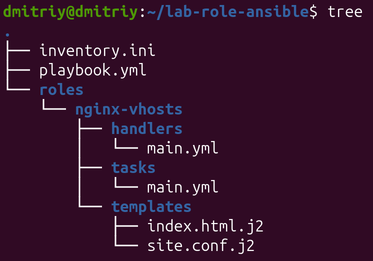
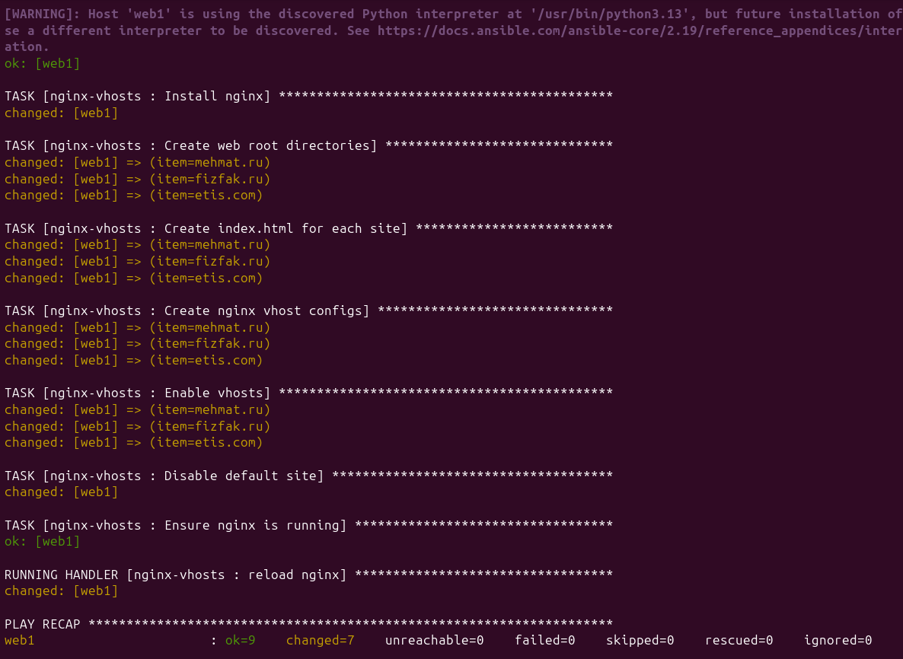
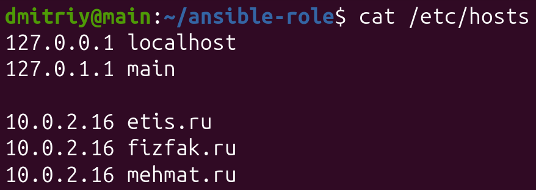
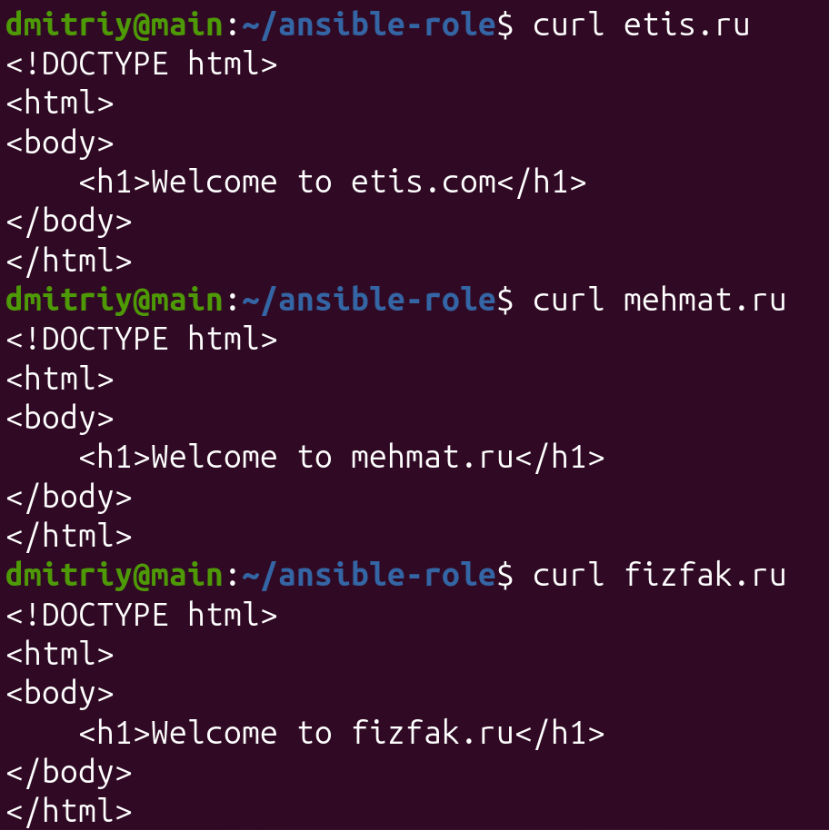
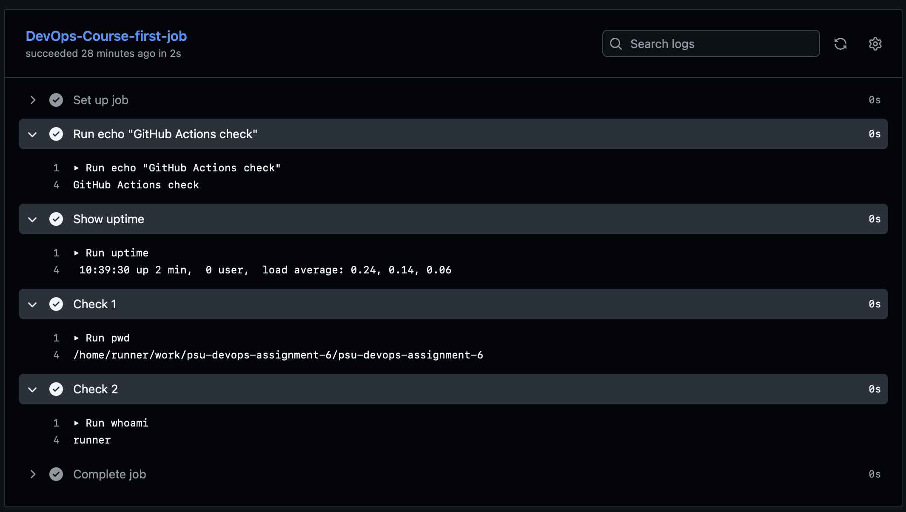
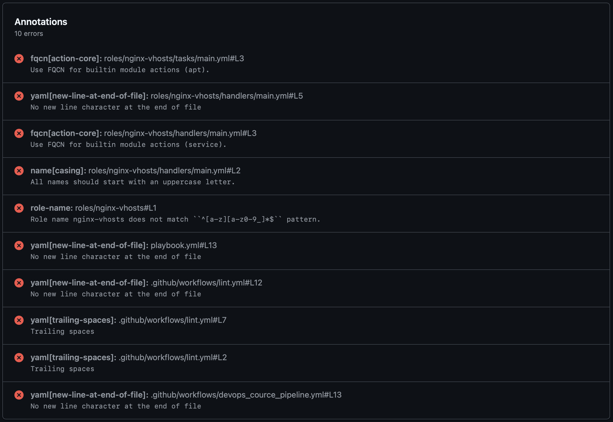

# DevOps Практическое задание №6.1 Ansible Roles
## Текст задания
Деплой веб-сервера с помощью Ansible Role
1. Сделать role, которая устанавливает nginx с vhosts
2. Роль устанавливает nginx
3. Виртуальные сайты задавать параметрами роли
4. Для каждого vhost из шаблона index.html.j2 создавать индексный файл
5. Для каждого vhost из шаблона {{site}}.conf.j2 создавать конфигурацию веб-сервера
6. Проверка через curl или браузер с подменой DNS

## Ход выполнения
### 1. Структура проекта
Организуем файловую систему роли

### 2. Файлы проекта
#### inventory.ini

Оставляем без изменений

#### playbook.yml

В директории `./roles/nginx-vhosts/tasks` формируем файл `playbook.yml`, который будет устанавливать nginx на хост, в цикле копировать конфиг для виртуального хоста, копировать стартовые страницы в каждый виртуальный сайт

#### index.html.j2

Формируем шаблон стартовой страницы

#### site.conf.j2

Формируем конфиг виртуального хоста vhost

#### playbook.yml 

Плейбук, использующий роль. В виде переменных передаются сайты `etis.ru`, `mehmat.ru` и `fizfak.ru`

### 3. Запуск

Осуществляем боевой прогон плейбука с использованием скрипта `run_playbook.sh`

### 4. Правка hosts

Правим `/etc/hosts` 

## Итог работы

# DevOps Практическое задание №6.2 GitHub Actions
## Текст задания

1. Создать репозиторий под новый проект
2. Склонировать репо к себе на ВМ командой git clone
3. Перенести в новый каталог с репо все файлы лабораторной
4. Добавить функции CI
5. Активировать Actions на стороне GitHub
6. Создать и протестировать CI-пайплайны

### 1. Инициализация репозитория

Инициализируем репозиторий `psu-devops-assignment-6`, активируем CI-пайплайны

### 2. Добавление пайплайнов

Создаем директорию `.github/workflows`, где создаем два сценария: один – тестовый, второй – "боевой" (линтер)

Коммитим и пушим их на GitHub

## Итог работы
Два сценария

 
---
Тестовый сценарий

---
Линтер
